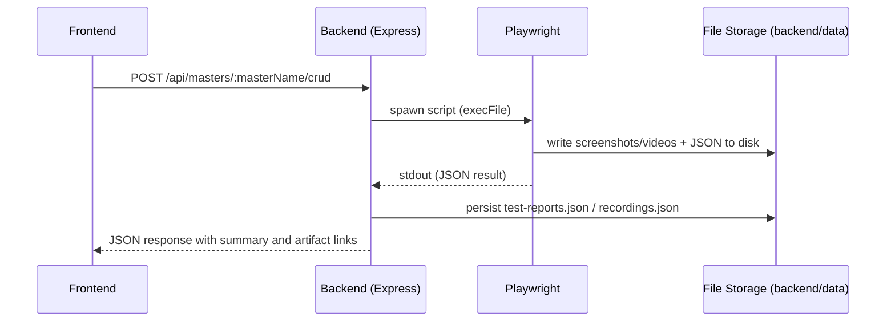

# Architecture

This document explains the high-level architecture and reasoning for the TestHive QuickFlow automation suite.

## High-level components

- Frontend: React + Vite web UI used by testers to trigger automation runs and inspect results.
- Backend: Node.js + Express orchestrator that spawns Playwright processes, indexes artifacts, and persists JSON summaries.
- Automation: Playwright scripts that run browser flows, emit machine-readable JSON on stdout, and capture screenshots/videos on failure.
- Storage: Local file storage for JSON indexes and artifacts (screenshots, HTML, video). In production you may swap this for S3 or object storage.

## Flow

1. User triggers an action in the frontend (run CRUD, fetch masters, run compliance checks).
2. Frontend calls backend REST endpoints.
3. Backend validates request and spawns a Playwright child process (`execFile`).
4. Playwright script runs against the target QuickFlow instance, writes artifacts, and prints a JSON result to `stdout`.
5. Backend parses stdout, persists a record in `backend/data/`, and exposes results via APIs for the frontend.

## Operational considerations

- Concurrency: Playwright runs are not queued in this repo. For multiple concurrent runs you should add a queue and worker pool.
- Artifact locking on Windows: server code already uses retries when renaming files to handle locking issues.
- Data retention: consider scheduled cleanup for historical artifacts.

## Extensibility

- Storage: replace local file persistence with S3 or other object stores; store metadata in a small DB (SQLite / PostgreSQL) for easier querying.
- Authentication: add a middleware gateway in front of Express (JWT or OAuth) to secure API.
- CI: create a lightweight smoke test job that runs Playwright tests in a headless runner.
