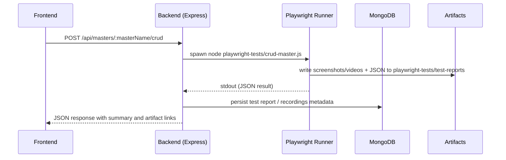

# Architecture

This document summarizes the current architecture of the TestHive automation framework and how the pieces interact.

## High-level components

- Frontend: React + Vite single-page app (uses react-router) that provides discovery, run, and reporting UIs. See [frontend/src/App.jsx](frontend/src/App.jsx).
- Backend: Node.js + Express API server that orchestrates Playwright runs, finalizes artifacts and persists metadata to MongoDB. See [backend/server.js](backend/server.js) and [backend/db/storage.js](backend/db/storage.js).
- Automation: Playwright automation lives under `playwright-tests/` and includes both standalone Node entry scripts (invoked by the backend) and a Playwright test-runner setup for developer testing. See [playwright-tests/playwright.config.js](playwright-tests/playwright.config.js).
- Storage: Metadata (test reports, recordings index, master/field caches) are persisted to MongoDB via the `backend/db` layer; binary artifacts (screenshots, videos, HTML) are written to the local artifacts folder at `playwright-tests/test-reports` and served statically by the backend on `/test-report-artifacts`.

## Typical request flow

1. User interaction in the Frontend triggers an API call (e.g. `POST /api/masters/:masterName/crud`).
2. The Backend receives the request, validates the payload and environment, and decides which automation runner to invoke.
3. The Backend spawns a child Node process (usually `execFile(process.execPath, [scriptPath])`) located under `playwright-tests/` (examples: `crud-master.js`, `fetch-masters.js`).
4. The Playwright script runs (optionally headless), writes artifacts to disk, and prints a single machine-readable JSON payload to stdout.
5. The Backend parses stdout, finalizes artifacts (rename/retry logic), writes metadata to MongoDB, and returns a JSON response to the Frontend containing status and artifact links.

## Where important logic lives

- Process orchestration, recording-capture and API endpoints: [backend/server.js](backend/server.js).
- Durable metadata & migration helpers: [backend/db/storage.js](backend/db/storage.js) and [backend/db/mongoClient.js](backend/db/mongoClient.js).
- Migration helper to move legacy JSON files into MongoDB: [backend/scripts/migrate-json-to-mongo.js](backend/scripts/migrate-json-to-mongo.js).
- Playwright tests and helper libraries: [playwright-tests/](playwright-tests/).

## Operational considerations

- Concurrency and scaling: the repo currently spawns processes directly. For higher throughput move to a job queue (Redis + Bull) and a pool of dedicated Playwright workers (recommended production pattern).
- Artifact finalization on Windows: Playwright video files can be locked while being written. The backend includes retry/rename logic (`tryRenameWithRetry`) to handle EBUSY/EPERM/EACCES scenarios — see [backend/server.js](backend/server.js).
- Data retention: recordings and test report collections are capped in storage; add periodic cleanup for binary artifacts to control disk usage.
- Secrets: connect the backend to a managed MongoDB (Atlas) using `MONGODB_URI` and keep Playwright credentials (`QT_USER`, `QT_PASS`) in environment variables or a secrets manager.

## Extensibility

- Replace local artifact storage with S3 (upload artifacts from workers and persist only metadata in MongoDB).
- Add authentication and RBAC in front of the Express API (JWT/OAuth gateway).
- If you need live streaming progress for long-running compliance runs, the backend already supports an SSE endpoint and an interruptible runner (see compliance endpoints in [backend/server.js](backend/server.js)).

Additional operational features
-------------------------------

- Realtime compliance & SSE: For long-running compliance suites use the async run endpoints:
  - `POST /api/compliance/runs` — start an async/realtime run (returns `{ runId, clientToken }`).
  - `GET /api/compliance/runs/:runId` — poll the persisted snapshot.
  - `GET /api/compliance/runs/:runId/stream` — consume a Server-Sent Events (SSE) stream using `EventSource` with `?clientToken=...` to receive `snapshot`, `progress`, `tc_result`, and `run_complete` events.

  The backend persists snapshots to the `compliance_runs` collection while the run is active and prunes old runs to a retention limit. Use the `clientToken` to authorize access to the snapshot and stream.

- Template workflow resume state: the template-workflow orchestration persists resume state to the `template_workflow_states` collection. The UI can query `GET /api/template-workflow/last-run` and `GET /api/template-workflow/last-passed` to show the most recent run or resume a partially completed flow.

- Migration helper: legacy JSON files under `backend/data/` (e.g. `master-fields.json`, `test-reports.json`, `recordings.json`, `crud-results.json`, and `last-run-state.json`) can be imported into MongoDB with `backend/scripts/migrate-json-to-mongo.js`. See `Docs/project-guide.md` for example commands.

## References

- Backend entrypoint: [backend/server.js](backend/server.js)
- Storage layer: [backend/db/storage.js](backend/db/storage.js)
- Playwright helpers & scripts: [playwright-tests/](playwright-tests/)

If you'd like, I can now update the repository Docs pages to include short troubleshooting sections for each component (startup errors, Mongo connection issues, Playwright video lock errors). Which one should I add first?
